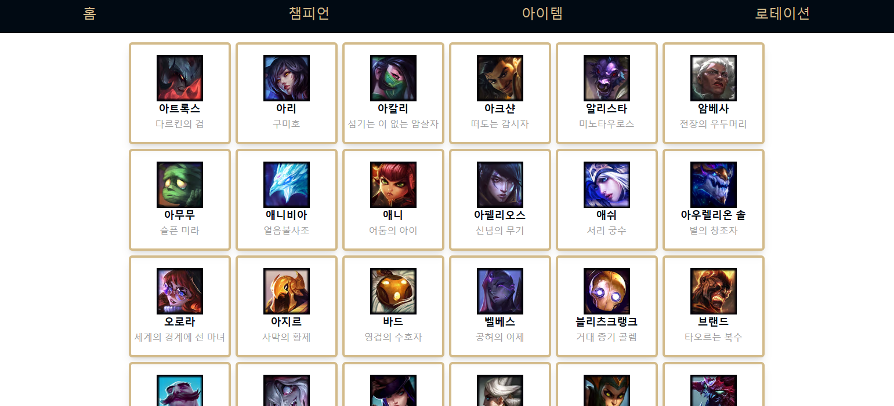
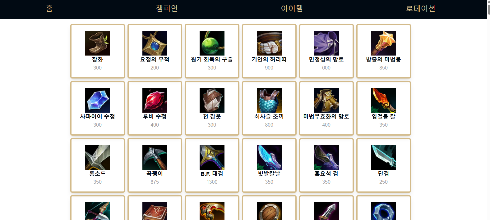
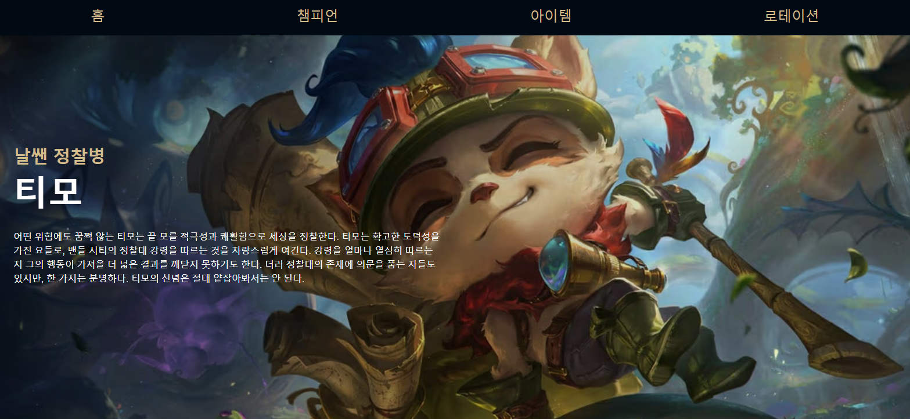
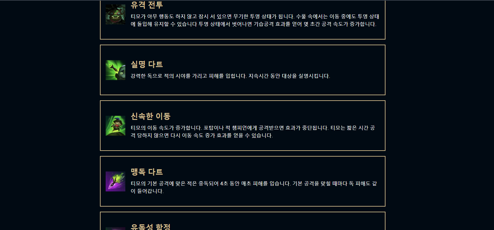

# 🎮 Dex of Legends: 한 눈에 보는 롤 정보
- **배포 주소** : https://league-dex.vercel.app/
 

 
 
 

## 📜프로젝트 소개
>**개발 기간 :** 2025/03/11 ~ 2025/03/18

**League of Legends 정보 사이트**  

유명 게임 League of Legends의 여러 정보를 알 수 있는 사이트입니다. 
챔피언 목록, 아이템 목록, 로테이션 목록을 볼 수 있으며, 챔피언 클릭 시 챔피언 상세 페이지로 넘어갑니다. 
 
 
 

## 🪄프로젝트 특징
- **TypeScript**를 이용하여 타입 안정성을 높였습니다. 

- **App routing** 을 사용하여 정적, 동적 라우팅을 구현했습니다.
- **Next.js**를 이용하여 여러 렌더링 기법들과 캐싱을 활용했습니다.
  - 페이지 별로 SSG, SSR, ISR, CSR 렌더링 기법을 적용했습니다.
- SSG, SSR, ISR의 경우 데이터를 패칭할 때 필요한 함수를 서버 액션으로 만들어 함수가 서버에서 실행되도록 했습니다.
- CSR의 경우 **Router Handler**와 **Tanstack Query**를 사용하여 api를 호출하여 데이터를 불러오도록 했습니다.  
- **TailwindCSS**를 사용하여 CSS in JS 스타일링 및 반응형 디자인을 구현했습니다.

 
 
 

## 🔫트러블 슈팅
- ### [useQuery에서 서버 액션을 사용할 수 없는 이유](https://velog.io/@arendt9797/%ED%8A%B8%EB%9F%AC%EB%B8%94%EC%8A%88%ED%8C%85)

 
 
 

## 🖥️기술 스택
### 환경
  

### 개발
 